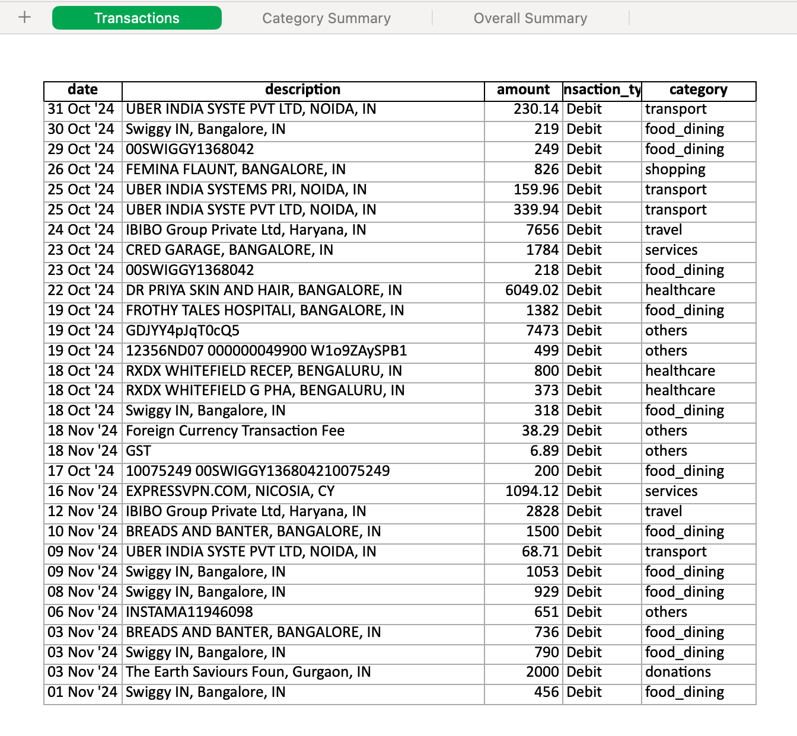

# Credit Card Statement Analyser

[](https://www.python.org/downloads/)
[](LICENSE)
[](https://github.com/psf/black)

A Python application to analyze Axis Bank credit card statements.

**Example Console output**
```
Analyzing statement: data/statements/AXISMB_24-11-2024.pdf
Parsing transactions...
Found 30 transactions
Converting to DataFrame...

=== Statement Analysis ===

Total Spending: ₹40,927.07
Total Credits: ₹0.00

Transactions by Category:
                Total  Count
category                    
donations     2000.00      1
food_dining   8050.00     12
healthcare    7222.02      3
others        8668.18      5
services      2878.12      2
shopping       826.00      1
transport      798.75      4
travel       10484.00      2
```

**Example Excel report Screenshot**


## 🚀 Features

- Read Axis Bank Credit card PDF statements (unlocked!)
- Generates a summary of the statement
- Generates Excel report with categorized transactions

## 📋 Requirements

- Python 3.8 or higher
- Dependencies listed in `requirements.txt`

## ⚡️ Quick Start

```bash
# Clone the repository
git clone https://github.com/username/cc-parser.git
cd project-name

# Create and activate virtual environment
python -m venv venv
source venv/bin/activate

# Install dependencies
pip install -r requirements.txt

# Run the application
python python run.py data/statements/<your PDF>
```

## 🧪 Testing
TODO 

## 🤝 Contributing

Contributions are welcome! Please feel free to submit a Pull Request. For major changes:

1. Fork the repository
2. Create your feature branch (`git checkout -b feature/AmazingFeature`)
3. Commit your changes (`git commit -m 'Add some AmazingFeature'`)
4. Push to the branch (`git push origin feature/AmazingFeature`)
5. Open a Pull Request

Would really appreciate if you could add different bank statements parser. Also can someone please help me with initial test setup. 
Also struggling with how to add categories to the transactions, the descriptions are gibberish for a lot of them, best case would be either an LLM classification or find some static mapping configuration. 

## 📜 License

This project is licensed under the MIT License - see the [LICENSE](LICENSE) file for details.

## 🙏 Acknowledgments

- Claude <3